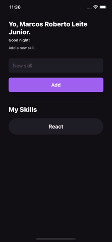

# My Skills
**MySkills** is a simple **React Native** app where users can add and remove skills to their list, keeping track of what they've learned.

## Technologies & Tools
* [reactjs](https://reactjs.org/)
* [react native](https://reactnative.dev)

## Demo

## TODO
* [ ] add styled components
* [ ] add typescript
* [ ] add authentication

## Acknowledgments
> This project was developed at Rocketseat's Bootcamp Ignite - Chapter 01.
* [Rocketseat's GitHub](https://github.com/rocketseat-education)
